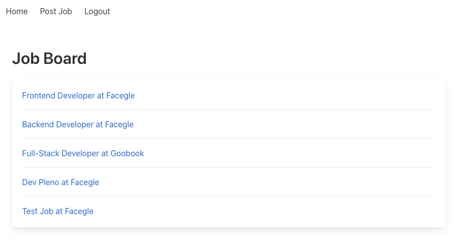
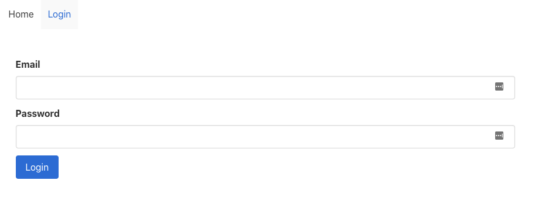
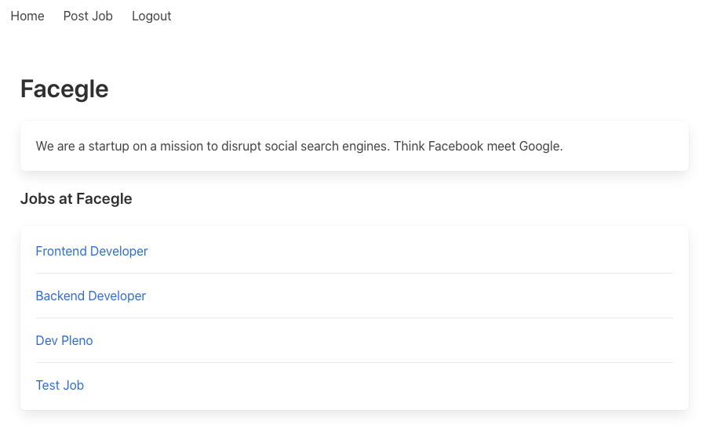
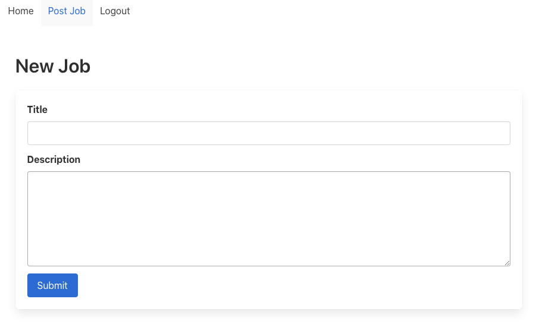

# GraphQL Job Board

Projeto de Estudo do Curso GraphQL by Example

## Install
### Server
```
npm install
```

### Client
```
npm install
```

## Run
### Server
```
npm start
```

### Client
```
npm start
```


## List all jobs


## Login form


## List all jobs by company


## Insert new job



